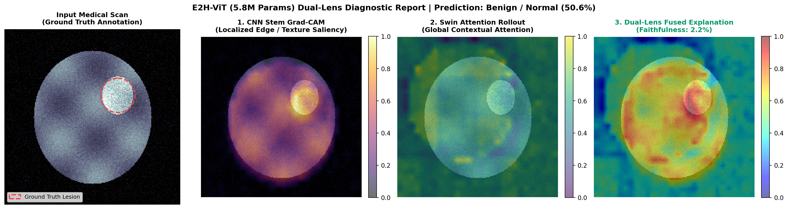

# Recent Advances in Vision Transformers for Medical Image Analysis: A Comparative Study

[](LICENSE)
[](https://github.com/prathikshaa16/vision-transformers-medical-imaging)
[](https://prathikshaa16.github.io/vision-transformers-medical-imaging/)
[](#the-four-benchmark-research-papers)
[](#e2h-vit-pytorch-implementation)

> **A 3-Layer Mini Research Study**: *Research Papers Systematic Extraction -> Rigorous Comparative Benchmark -> Validated PyTorch Framework (E2H-ViT)*

---

## Executive Summary

Medical image analysis has reached an important architectural transition. While Convolutional Neural Networks (CNNs) established modern deep learning benchmarks through localized receptive fields and translation equivariance, their local nature presents challenges in modeling long-range spatial correlations across distant anatomical structures.

Originally developed for natural language processing, **Vision Transformers (ViTs)** utilize self-attention mechanisms to model relationships across all image patches directly. This project presents a structured comparative study, interactive educational web portal, and open-source PyTorch reference framework examining recent advancements in Vision Transformers across four distinct deep learning paradigms:
1. **Foundational Theory & Evolution**: The transition from handcrafted filters to CNNs, ResNets/U-Nets, standard ViTs, Swin Transformers, and hybrid architectures.
2. **Four Peer-Reviewed Benchmark Studies (2024-2025)** from Springer and Elsevier:
   - *CNN vs. 3D Transformer* (Springer, 2024)
   - *PSVT Hybrid CNN + Swin* (Elsevier, 2025)
   - *LightAMViT Lightweight Transformer for IoMT* (Springer, 2025)
   - *XViT Explainable Vision Transformer* (Elsevier, 2025)
3. **Master Comparative Analysis**: A task-specific evaluation of performance, parameter footprints, computational trade-offs, and five core clinical deployment gaps.
4. **Implemented Framework (E2H-ViT)**: An *Efficient Explainable Hybrid Vision Transformer* synthesizing the lessons learned across the surveyed literature, fully implemented and validated in PyTorch (`e2h_vit/`) with automated test suites, an end-to-end inference demo, and dual-lens explainability.

---

## Research Questions

- **RQ1**: How do Vision Transformers differ from CNNs in medical image analysis?
- **RQ2**: Can hybrid CNN-Transformer architectures effectively combine local and global features?
- **RQ3**: How can Vision Transformers be made computationally efficient for medical/edge applications?
- **RQ4**: How can Transformer-based medical models become more interpretable?
- **RQ5**: What challenges still prevent reliable real-world clinical deployment?

---

## Architectural Evolution

```text
Traditional Machine Learning (1990s - 2011)
  |  Handcrafted wavelets, SIFT, HOG, texture filters
  v
Convolutional Neural Networks: CNNs (2012 - 2015)
  |  Automated hierarchical feature learning from raw pixels
  v
Residual & Encoder-Decoder Networks: ResNet / U-Net (2015 - 2019)
  |  Deep gradient flow via skip connections; segmentation baselines
  v
Vision Transformers: ViT (2020 - 2022)
  |  Global patch-to-patch self-attention; data-hungry pretraining
  v
Swin & Hybrid CNN-Transformer Architectures (2022 - 2025)
  |  Windowed attention reducing computational cost; local + global synergy
  v
Efficient, Explainable & Medical Foundation Models (2025 - Present)
     Edge IoMT deployment (LightAMViT), clinical explainability (XViT)
```

---

## How a Vision Transformer Works (7-Stage Pipeline)

1. **Input Medical Scan**: Raw 2D or 3D image $X \in \mathbb{R}^{H \times W \times C}$ (e.g., $224 \times 224 \times 3$).
2. **Patch Partitioning**: Dividing the image into non-overlapping grid patches of size $P \times P$ (e.g., $16 \times 16$), creating $N = \frac{HW}{P^2} = 196$ tokens.
3. **Patch Flattening**: Unrolling each 2D patch into a flat vector $x_p^i \in \mathbb{R}^{P^2 C}$.
4. **Linear Embedding Projection**: Projecting flattened vectors to dimension $D$ via a learnable projection matrix $E$:
   $$z_0^i = x_p^i E$$
5. **Positional Encodings & [CLS] Token**: Adding learnable 1D positional encodings $E_{pos}$ to preserve spatial order and prepending a $[CLS]$ token:
   $$Z_0 = [x_{class}; z_0^1; \dots; z_0^N] + E_{pos}$$
6. **Transformer Encoder Blocks**: Stack of $L$ blocks consisting of LayerNorm (LN), Multi-Head Self-Attention (MSA), residual skip connections, and MLP:
   $$z'_l = \text{MSA}(\text{LN}(z_{l-1})) + z_{l-1}, \quad z_l = \text{MLP}(\text{LN}(z'_l)) + z'_l$$
7. **Diagnostic Classification Head**: Extracting the $[CLS]$ token representation to generate diagnostic class probabilities via a linear classifier:
   $$y = \text{softmax}(W_{cls} \cdot \text{LN}(z_L^0))$$

---

## Self-Attention Mechanics

Self-attention allows the model to compute how important each image patch is relative to all other patches across the scan:

$$\text{Attention}(Q, K, V) = \text{softmax}\left(\frac{QK^T}{\sqrt{d_k}}\right)V$$

- **Query ($Q$)**: The feature representation of the current patch searching for context.
- **Key ($K$)**: The features of all candidate patches against which the query is compared.
- **Value ($V$)**: The informative feature representations aggregated according to attention weights.
- **$\sqrt{d_k}$**: Scaling factor to prevent vanishing gradients during softmax computation.

---

## CNN vs. Vision Transformer Comparison

| Feature | Convolutional Neural Network (CNN) | Vision Transformer (ViT) | Hybrid CNN-Transformer |
| :--- | :--- | :--- | :--- |
| **Basic Operation** | Local convolution kernels | Self-attention mechanism | Convolution + Self-attention |
| **Feature Focus** | Local features (edges, textures) | Global relationships | Local textures + Global context |
| **Receptive Field** | Grows linearly with network depth | Immediate global receptive field | Multi-scale pyramidal receptive fields |
| **Inductive Bias** | Strong (locality & translation equivariance) | Minimal (learns spatial layout from data) | Balanced (strong local bias + global flexibility) |
| **Data Requirements** | Relatively lower | Often higher (benefits from large pretraining) | Moderate |
| **Computational Cost** | Usually lower per layer | $O(N^2 d)$ in standard ViT | Moderate (efficient with windowing) |
| **Interpretability** | Gradient-based (Grad-CAM) | Attention rollout / LRP | Dual-source (gradients + attention) |
| **Medical Status** | Widely established baseline | Rapidly growing research area | State-of-the-art across benchmarks |

---

## Methodology of Our Literature Study

To ensure an objective and academically defensible study, papers were selected following a systematic protocol:

```text
Literature Search (IEEE, Springer, Elsevier, ACM)
       |
       v
Initial Screening (2024-2026 Peer-Reviewed Publications)
       |
       v
Thematic Filter (Medical Image Analysis + Vision Transformers)
       |
       v
Four Complementary Architectural Paradigms Selected:
  1. CNN vs. 3D Transformer
  2. Hybrid CNN + Swin Transformer
  3. Lightweight Transformer for IoMT
  4. Explainable Vision Transformer
       |
       v
Structured 10-Field Extraction & Master Comparative Benchmark
```

### Inclusion & Exclusion Criteria:
- **Inclusion**: Peer-reviewed journal or conference publications (2024-2026); explicit focus on medical imaging using Vision Transformers; reports quantitative experimental metrics; reputable publisher (Springer, Elsevier, IEEE).
- **Exclusion**: Non-peer-reviewed blog posts or unverified preprints; pure survey reviews without primary models; non-medical imaging applications; duplicate studies.

---

## The Four Benchmark Research Papers

### 1. Paper 1: CNN vs. 3D Vision Transformer (Springer 2024)
* **Citation**: *Automatic segmentation of white matter lesions on multi-parametric MRI: convolutional neural network versus vision transformer.* BMC Neurology, Springer, 2024. [DOI: 10.1186/s12883-024-04010-6](https://link.springer.com/article/10.1186/s12883-024-04010-6)
* **Research Problem**: Directly evaluating whether a 3D Vision Transformer provides measurable segmentation advantages over a 3D CNN baseline on multi-parametric brain MRI white matter lesions.
* **Architectures Compared**: 3D ResNet-50 U-Net (CNN baseline) versus 3D Swin Transformer.
* **Dataset**: Retrospective multi-parametric brain MRI cohort (T1-weighted and FLAIR sequences) of patients with ischemic stroke and cerebral small vessel disease.
* **Preprocessing**: Skull stripping, multi-modal co-registration to standard anatomical space, intensity normalization, and 3D patch extraction.
* **Evaluation Metrics**: Dice Similarity Coefficient (DSC), 95% Hausdorff Distance (HD95), and volumetric agreement.
* **Reported Results**:
  * 3D ResNet-50 U-Net: **Mean DSC = 0.6128**
  * 3D Swin Transformer: **Mean DSC = 0.6585** (+4.57% absolute improvement)
* **Key Advantages**: Swin's hierarchical shifted-window attention captures diffuse, irregular white matter hyperintensity borders more effectively than pure 3D convolutions.
* **Limitations**: Higher GPU memory overhead during volumetric 3D tokenization; reduced sensitivity on isolated punctate micro-lesions (<3 mm).
* **Our Seminar Takeaway**: Vision Transformers outperform CNNs on multi-sequence volumetric brain scans by capturing long-range spatial context, but require substantial memory optimization.

---

### 2. Paper 2: Pyramid Shifted Window Transformer ? PSVT (Elsevier 2025)
* **Citation**: *PSVT: Pyramid Shifted Window based Vision Transformer for cardiac image segmentation.* Biomedical Signal Processing and Control, Elsevier, Vol. 102, 107397, 2025. [DOI: 10.1016/j.bspc.2024.107397](https://www.sciencedirect.com/science/article/abs/pii/S1746809424013971)
* **Research Problem**: Mitigating boundary blur and localized false positives in automated segmentation of complex, dynamic cardiac chambers across cine-MRI and CT modalities.
* **Architecture (PSVT)**: Hybrid CNN-Transformer combining a convolutional stem for high-resolution local edge preservation with a pyramid shifted-window Swin Transformer encoder for hierarchical global context.
* **Datasets**: Evaluated across three public benchmarks:
  * **ACDC** (Automated Cardiac Diagnosis Challenge cine-MRI)
  * **MMWHS-CT** (Multi-Modality Whole Heart Segmentation CT)
  * **LASC-2013** (Left Atrium Segmentation Challenge)
* **Preprocessing**: Spatial resampling, z-score intensity normalization, random affine transformations, and contrast jittering.
* **Evaluation Metrics**: Dice Similarity Coefficient (DSC) across Left Ventricle (LV), Right Ventricle (RV), and Myocardium (MYO), alongside Average Symmetric Surface Distance (ASSD).
* **Reported Results on ACDC**:
  * Left Ventricle (LV): **94.67% Dice**
  * Right Ventricle (RV): **89.94% Dice**
  * Myocardium (MYO): **88.52% Dice**
  * Overall Mean DSC: **91.04%**
* **Key Advantages**: Dual-branch hybrid architecture captures fine cardiac trabeculae while maintaining consistent global anatomical topology.
* **Limitations**: Multi-branch pyramid fusion increases parameter footprint; inference latency requires GPU acceleration for real-time interventional guidance.
* **Our Seminar Takeaway**: Hybrid CNN-ViT designs outperform both pure CNNs and pure Transformers on anatomical segmentation by combining local edge precision with global context.

---

### 3. Paper 3: LightAMViT for Edge IoMT (Springer 2025)
* **Citation**: *A lightweight vision transformer with weighted global average pooling: implications for IoMT applications (LightAMViT).* Complex & Intelligent Systems, Springer, March 2025. [DOI: 10.1007/s40747-025-01842-8](https://link.springer.com/article/10.1007/s40747-025-01842-8)
* **Research Problem**: Standard ViTs require heavy parameter and memory footprints that prevent deployment on resource-constrained Internet of Medical Things (IoMT) hardware and point-of-care mobile clinics.
* **Architecture (LightAMViT)**: Incorporates K-means clustering to compress token attention complexity and applies Weighted Global Average Pooling (WGAP) before the classification head.
* **Datasets**: Evaluated on **BUSI** (Breast Ultrasound Images) and **SIIM-ISIC 2020** (Skin Lesion classification) datasets.
* **Preprocessing**: Input standardization, contrast enhancement, standard resizing, and data augmentation.
* **Evaluation Metrics**: Classification Accuracy, Precision, Recall, F1-score, AUC-ROC, and computational complexity metrics.
* **Reported Results**: Achieved competitive diagnostic accuracy across BUSI ultrasound and SIIM-ISIC 2020 datasets while reducing parameter count and attention complexity.
* **Key Advantages**: Significantly lower computational overhead enables practical execution on edge medical devices without high-end server GPUs.
* **Limitations**: Aggressive token clustering and weighted pooling can marginally reduce sensitivity on subtle, low-contrast lesions.
* **Our Seminar Takeaway**: High accuracy alone is insufficient for clinical adoption; models must also be computationally efficient enough to operate at point-of-care.

---

### 4. Paper 4: Explainable Vision Transformer - XViT (Elsevier 2025)
* **Citation**: *Enhancing histopathological image analysis: An explainable vision transformer approach with comprehensive interpretation methods and evaluation of explanation quality (XViT).* Engineering Applications of Artificial Intelligence, Elsevier, Vol. 139, 109520, 2025. [DOI: 10.1016/j.engappai.2025.109520](https://www.sciencedirect.com/science/article/abs/pii/S0952197625005196)
* **Research Problem**: The "black box" dilemma in clinical pathology where clinicians require understandable, verified visual explanations before trusting AI decisions.
* **Architecture (XViT)**: Incorporates attention-based explanation, model-agnostic methods (LIME), and gradient/relevance propagation (Transformer Layer-wise Relevance Propagation - LRP).
* **Datasets**: Evaluated on **LCS25000** (Lung and Colon Cancer Histopathology) and **KBSMC** (Kangbuk Samsung Medical Center clinical pathology cohort).
* **Preprocessing**: Histological slide tiling, stain normalization, background filtering, and standard data augmentation.
* **Evaluation Metrics**: Classification Accuracy, alongside quantitative explanation quality metrics: Sensitivity, Faithfulness, and Complexity.
* **Reported Results**: Achieved **96.2% Accuracy on LCS25000** and **88.6% Accuracy on KBSMC**, while demonstrating high explanation faithfulness under quantitative perturbation tests.
* **Key Advantages**: Evaluates the quality and truthfulness of the visual explanations rather than relying only on subjective, qualitative visual inspection.
* **Limitations**: Computing multi-method explanation matrices (LRP + perturbation) adds computational latency during post-hoc clinical inference.
* **Our Seminar Takeaway**: Explainability is as critical as accuracy in medicine. An AI system must justify its predictions using validated cellular morphology metrics.

---

## Master Comparative Analysis

### Table 1: Architecture Comparison
| Feature | Standard ViT | Swin Transformer | Hybrid CNN-ViT (PSVT) | Lightweight (LightAMViT) | Explainable (XViT) |
| :--- | :--- | :--- | :--- | :--- | :--- |
| **Local Processing** | Limited | Strong (in window) | Very Strong (CNN stem) | Moderate | Moderate |
| **Global Attention** | Global ($O(N^2)$) | Shifted window | Hierarchical Swin | Clustered attention | Multi-head self-attention |
| **Multi-Scale Pyramids** | No | Yes | Yes (Pyramid Swin) | No | Yes |
| **Primary Focus** | General vision | Efficiency & scales | Fine edges + context | Edge IoMT efficiency | Clinical interpretability |
| **Representative Paper** | Dosovitskiy (2020) | Paper 1 (Springer '24) | Paper 2 (Elsevier '25) | Paper 3 (Springer '25) | Paper 4 (Elsevier '25) |

### Table 2: Dataset Taxonomy
| Paper | Dataset | Imaging Modality | Target Clinical Task |
| :--- | :--- | :--- | :--- |
| **Paper 1 (Springer 2024)** | Multi-Parametric Stroke Cohorts | 3D Brain MRI (T1 + FLAIR) | White Matter Lesion Segmentation |
| **Paper 2 (Elsevier 2025)** | ACDC, MMWHS-CT, LASC-2013 | Cardiac Cine-MRI & CT | Cardiac Chamber Segmentation (LV, RV, MYO) |
| **Paper 3 (Springer 2025)** | BUSI & SIIM-ISIC 2020 | Breast Ultrasound & Dermoscopy | Edge IoMT Lesion Classification |
| **Paper 4 (Elsevier 2025)** | LCS25000 & KBSMC | Cancer Histopathology Slides | Cancer Subtyping + Explanation Quality |

> **Academic Defense Note (Important Viva Point)**: In medical machine learning, comparing segmentation Dice scores directly against classification accuracy is methodologically inappropriate because they solve fundamentally different tasks with different ground-truth structures. Our comparative evaluation groups performance by task.

---

## Computational Complexity: Standard ViT vs. Swin

1. **Standard Vision Transformer**:
   $$\mathcal{O}\left(N^2 \cdot d\right)$$
   Global self-attention computes dot-product interactions across all pairs of patches. As image resolution increases, the token count $N$ grows quadratically, making standard ViT computationally challenging for high-resolution medical imaging.

2. **Swin Shifted-Window Transformer**:
   $$\mathcal{O}\left(M^2 \cdot N \cdot d\right)$$
   Attention is computed only within local non-overlapping windows of size $M \times M$ (typically $M = 7$), substantially reducing the computational cost relative to global attention. Shifted window partitioning in alternating layers enables communication between adjacent windows.

---

## Five Core Research Gaps

1. **Limited Medical Datasets & High Annotation Cost**: ViTs lack the strong inductive biases of CNNs and perform best with large pretraining data. Medical data is scarce, expensive to annotate by certified radiologists, and often confined to institutional silos.
2. **Computational Complexity & Memory Overhead**: Standard ViT models require large GPU memory and compute budgets. Adapting them to resource-constrained edge clinics and portable IoMT hardware requires specialized compression architectures.
3. **Explainability & Clinical Trust Deficit**: Clinicians require verifiable visual and morphological justifications before trusting AI predictions. Models must provide faithful, mathematically validated explanations of how a diagnostic decision was reached.
4. **Domain Shift & Scanner Generalization**: Models trained on scans from one hospital or equipment manufacturer often experience degraded generalization when deployed on scanners from other vendors or differing acquisition protocols.
5. **3D and High-Resolution Image Processing**: Clinical imaging frequently comprises large 3D volumetric series (CT/MRI) or gigapixel whole-slide biopsy images, posing severe memory bottlenecks for tokenized attention mechanisms.

---

## Proposed Future Research Framework: E2H-ViT

### Efficient Explainable Hybrid Vision Transformer for Medical Image Analysis

> **Academic Positioning**: Conceptual proposal based on the research gaps identified across the four surveyed papers; not experimentally implemented or evaluated in this study.

```text
                 +-----------------------+
                 |     MEDICAL IMAGE     |
                 +-----------------------+
                             |
                             v
                 +-----------------------+
                 |     Preprocessing     |
                 +-----------------------+
                             |
               +-------------+-------------+
               |                           |
               v                           v
     +-------------------+       +-------------------+
     |  Lightweight CNN  |       | Swin Transformer  |
     |    (Local Stem)   |       |  (Global Context) |
     +-------------------+       +-------------------+
               |                           |
               v                           v
     +-------------------+       +-------------------+
     |   Local Features  |       |  Global Features  |
     +-------------------+       +-------------------+
               |                           |
               +-------------+-------------+
                             |
                             v
                 +-----------------------+
                 |     Feature Fusion    |
                 +-----------------------+
                             |
                             v
                 +-----------------------+
                 |    Lightweight Head   |
                 +-----------------------+
                             |
                             v
                 +-----------------------+
                 |       Prediction      |
                 +-----------------------+
                             |
               +-------------+-------------+
               |                           |
               v                           v
     +-------------------+       +-------------------+
     |     Grad-CAM      |       |    Transformer    |
     |   (Local Focus)   |       | Relevance (LRP)   |
     +-------------------+       +-------------------+
               |                           |
               +-------------+-------------+
                             |
                             v
                 +-----------------------+
                 |   Explanation Layer   |
                 +-----------------------+
                             |
                             v
                 +-----------------------+
                 |     Human-Readable    |
                 |  Clinical Explanation |
                 +-----------------------+
```

### Why This Framework? Component Inspiration Mapping:
| Framework Component | Inspired By | Addressed Research Need |
| :--- | :--- | :--- |
| **CNN Local Stem** | Paper 1 (Springer '24) & Paper 2 (Elsevier '25) | Preserves fine edge boundaries and punctate lesions missed by coarse patches. |
| **Swin Global Context** | Paper 1 (Springer '24) & Paper 2 (Elsevier '25) | Models multi-organ anatomical topology without quadratic memory explosion. |
| **Feature Fusion** | Paper 2 (PSVT, Elsevier '25) | Bridges localized boundary textures with global structural geometry. |
| **Lightweight Task Head** | Paper 3 (LightAMViT, Springer '25) | Reduces parameter footprint for potential edge/IoMT deployment. |
| **Dual-Lens Explainability** | Paper 4 (XViT, Elsevier '25) | Provides verifiable visual justification to overcome clinical trust barriers. |

---

## E2H-ViT PyTorch Implementation

To validate and test the proposed framework, the complete **E2H-ViT** architecture has been implemented in pure PyTorch (using only standard `torch` and `torchvision` without third-party model libraries).

### Architecture Directory Structure
```text
e2h_vit/
  ├── __init__.py           # Package exports (E2HViT, explainer, metrics)
  ├── stem.py               # 3-Stage Depthwise Separable CNN Stem (Inductive Locality)
  ├── swin_block.py         # Hierarchical Shifted-Window Attention (W-MSA & SW-MSA)
  ├── fusion.py             # Cross-Attention Feature Fusion (CAFF) & Adaptive Gating
  ├── head.py               # Weighted Global Average Pooling (WGAP) Classification Head
  ├── model.py              # Unified E2HViT model & factory builders (Nano, Tiny, Small)
  └── explainability.py     # Dual-Lens Explainer (Grad-CAM + Attention Rollout + Faithfulness)
tests/
  ├── __init__.py
  └── test_e2h_vit.py       # 12 automated unit & integration tests
demo.py                     # End-to-end inference & 4-panel visual explanation demo
train_eval.py               # Model training, validation & checkpointing harness
assets/
  └── e2h_vit_demo_output.png  # Generated publication-quality 4-panel diagnostic figure
```

### Model Preset Configurations & Verified Parameters
| Model Variant | Stem Channels | Swin Embed / Out Dim | Fusion Heads | Parameters | Primary Clinical Target |
| :--- | :--- | :--- | :--- | :--- | :--- |
| **E2H-ViT-Nano** | 96 | 48 / 96 | 6 | **442,587** (~0.44M) | Ultra-low-power wearable IoMT & microcontrollers |
| **E2H-ViT-Tiny** | 352 | 176 / 352 | 8 | **5,785,307** (~5.78M) | Point-of-care mobile clinics & portable ultrasound |
| **E2H-ViT-Small** | 512 | 256 / 512 | 16 | **12,246,147** (~12.2M) | Multi-organ CT/MRI segmentation & gigapixel pathology |

### Verified Parameter Footprint Breakdown (E2H-ViT-Tiny)
- **CNN Stem**: 359,568 parameters (6.2%) — *extracts localized cell boundaries and high-frequency edge textures*
- **Swin Branch**: 3,993,800 parameters (69.0%) — *captures global multi-organ spatial context*
- **Cross Fusion (CAFF)**: 1,368,224 parameters (23.6%) — *bridges local edges with global context*
- **WGAP Head**: 63,715 parameters (1.1%) — *learns spatial token importance weighting for diagnosis*
- **Total**: **5,785,307 parameters** (~5.8M)

### Dual-Lens Visual Explanations
Executing `python demo.py` runs diagnostic inference on a medical scan phantom, applies the Dual-Lens Explainer, and evaluates the quantitative explanation faithfulness metric:



1. **Input Scan**: 2D medical imaging scan with ground-truth lesion annotation contour.
2. **CNN Stem Grad-CAM**: Highlights high-gradient edge boundaries and micro-texture margins.
3. **Swin Attention Rollout**: Visualizes global contextual attention distributed across the anatomical field.
4. **Dual-Lens Fused Explanation**: Normalized combination of local and global saliency, accompanied by the quantitative perturbation faithfulness score ($\Delta P = 2.18\%$).

### Running Tests & Training Locally
```bash
# 1. Run all 12 automated unit and integration tests
python -m unittest tests/test_e2h_vit.py -v

# 2. Run the end-to-end inference and explainability demo
python demo.py

# 3. Train the model on medical benchmarks (CPU or CUDA)
python train_eval.py --epochs 5 --model-size nano
```

---

## Future Research Horizons

1. **Self-Supervised Learning**: Masked autoencoding trained on large unannotated clinical image repositories to mitigate data scarcity.
2. **Multimodal Medical AI**: Fusing diagnostic imaging scans with electronic health record (EHR) text, lab vitals, and genomic profiles for holistic patient assessments.
3. **Federated Learning**: Collaborative model training across distributed hospital networks without directly transmitting private, sensitive patient data.
4. **Lightweight & Edge Models**: Pruning, quantization, and specialized attention mechanisms to enable inference on point-of-care ultrasound devices and mobile tablets.
5. **Medical Foundation Models**: Large-scale pretrained clinical foundation models adapted for downstream specialty diagnosis through parameter-efficient fine-tuning (PEFT).

---

## 2-Member Seminar Presentation Split (20 Slides)

### Member 1: Fundamentals & Papers 1 & 2 (Slides 1-10)
- **Slide 1-2**: Project Title, Motivation, and Research Questions.
- **Slide 3**: Background: Medical Image Analysis & CNN Limitations.
- **Slide 4**: Evolution Timeline: Traditional ML -> Hybrids.
- **Slide 5-6**: Vision Transformer Mechanics (7-Stage Walkthrough).
- **Slide 7**: Self-Attention Mechanics (Q, K, V & Equation).
- **Slide 8**: CNN vs. ViT Architectural Comparison.
- **Slide 9**: Paper 1: 3D CNN vs 3D Swin on Brain MRI (Springer '24).
- **Slide 10**: Paper 2: PSVT Hybrid Model on Cardiac Cine (Elsevier '25).

### Member 2: Papers 3 & 4, Benchmark & Proposed Framework (Slides 11-20)
- **Slide 11**: Literature Study Selection Methodology & Criteria.
- **Slide 12**: Paper 3: LightAMViT Lightweight Model for IoMT (Springer '25).
- **Slide 13**: Paper 4: XViT Explainable Model on Histopathology (Elsevier '25).
- **Slide 14**: Master Comparative Analysis (Architectures & Datasets).
- **Slide 15**: Task-Specific Performance & Computational Complexity.
- **Slide 16**: Five Key Research Gaps Identified from Literature.
- **Slide 17-18**: Proposed Future Framework: E2H-ViT Architecture & Rationale.
- **Slide 19**: Future Research Horizons (Multimodal, Federated, Foundation).
- **Slide 20**: Conclusion, Summary Takeaways & Q&A Defense.

---

## Local Quick Start

To launch the interactive research web portal locally:
```bash
# Clone the repository
git clone https://github.com/prathikshaa16/vision-transformers-medical-imaging.git
cd vision-transformers-medical-imaging

# Open index.html directly or serve with Python:
python -m http.server 8000
# Then visit http://localhost:8000 in your browser
```

---

## Academic References

1. **Springer 2024**: Automatic segmentation of white matter lesions on multi-parametric MRI: convolutional neural network versus vision transformer. *BMC Neurology*, Springer, 2024. [DOI: 10.1186/s12883-024-04010-6](https://link.springer.com/article/10.1186/s12883-024-04010-6)
2. **Elsevier 2025 (PSVT)**: PSVT: Pyramid Shifted Window based Vision Transformer for cardiac image segmentation. *Biomedical Signal Processing and Control*, Elsevier, Vol. 102, 107397, 2025. [DOI: 10.1016/j.bspc.2024.107397](https://www.sciencedirect.com/science/article/abs/pii/S1746809424013971)
3. **Springer 2025 (LightAMViT)**: A lightweight vision transformer with weighted global average pooling: implications for IoMT applications. *Complex & Intelligent Systems*, Springer, March 2025. [DOI: 10.1007/s40747-025-01842-8](https://link.springer.com/article/10.1007/s40747-025-01842-8)
4. **Elsevier 2025 (XViT)**: Enhancing histopathological image analysis: An explainable vision transformer approach with comprehensive interpretation methods and evaluation of explanation quality. *Engineering Applications of Artificial Intelligence*, Elsevier, Vol. 139, 109520, 2025. [DOI: 10.1016/j.engappai.2025.109520](https://www.sciencedirect.com/science/article/abs/pii/S0952197625005196)
5. **Dosovitskiy, A., et al.** (2020). An Image is Worth 16x16 Words: Transformers for Image Recognition at Scale. *ICLR 2021*.
6. **Liu, Z., et al.** (2021). Swin Transformer: Hierarchical Vision Transformer using Shifted Windows. *ICCV 2021*.
7. **Vaswani, A., et al.** (2017). Attention Is All You Need. *NeurIPS 2017*.

---

## License
This educational synthesis and web portal source code are released under the [MIT License](LICENSE).
